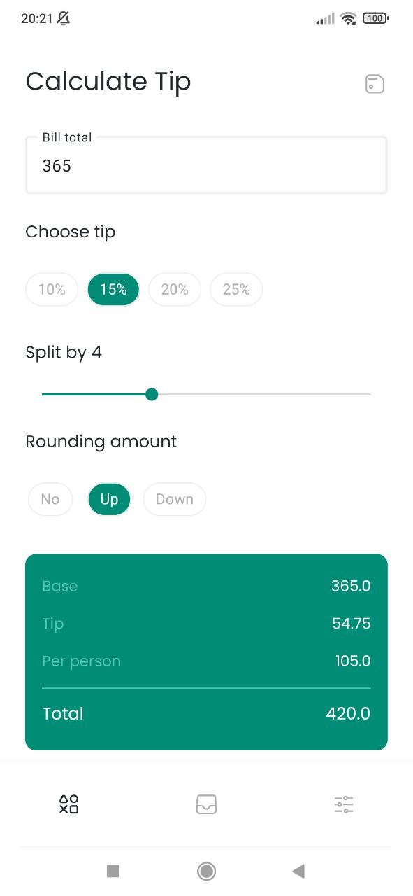
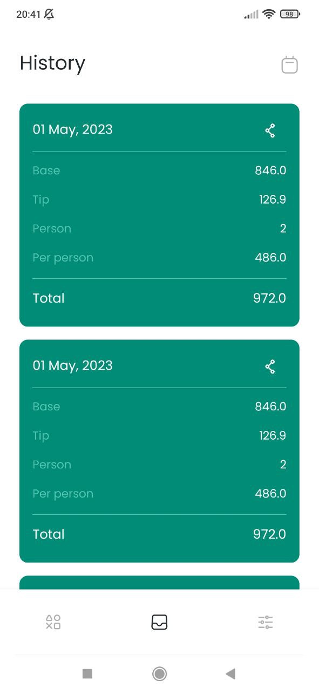
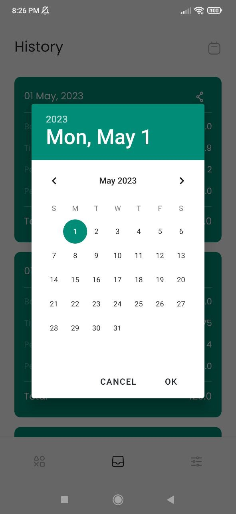
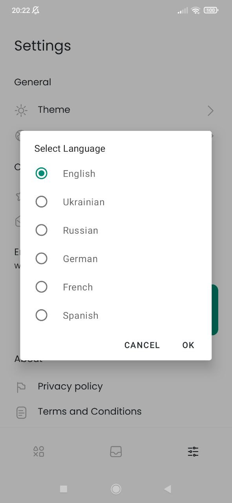
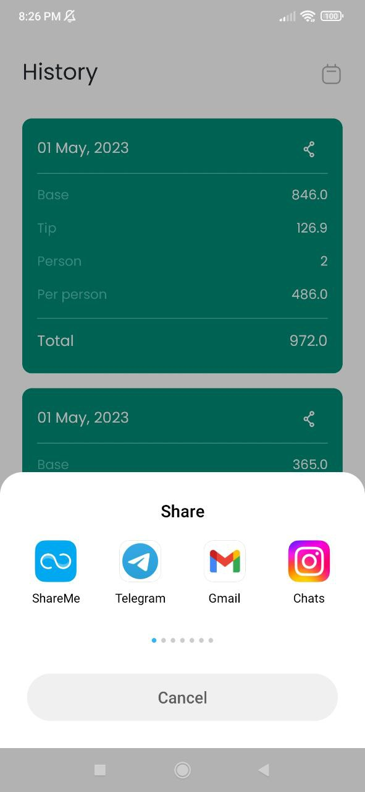
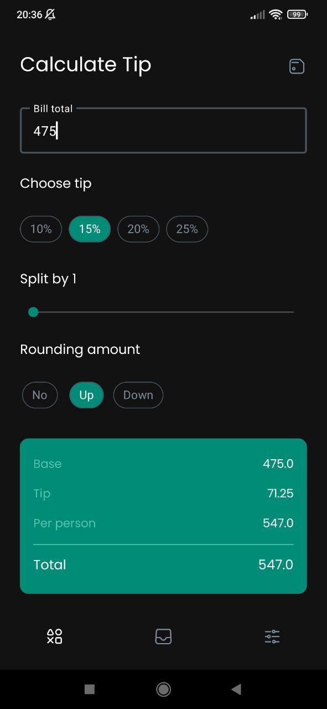

# 🖩 TipCalc - Tip Calculator

**TipCalc** is the ultimate tool for anyone looking to simplify the process of calculating tips and splitting bills.

> Tip with ease, split with simplicity - let our Tip Calculator do the math

Is also part of my portfolio projects :) It showcases my skills regarding developing Android apps.

## 🚀Currently available on the Play store

<a href="https://play.google.com/store/apps/details?id=com.bejussi.tipcalculator"></a>

## 📸 Screenshots

  
  


## 🔥 Features

* Calculate tip
* History tab
* Calculation results sharing
* Split number
* Rounding
* Light/Dark themes
* All data are stored locally on the device
* Support for multiple languages

## 🔧 Built With

* Kotlin
* MVVM
* Room
* Coroutines
* Preferences DataStore
* Navigation Component
* View Banding
* Dagger Hilt
* Lottie

## ⚡ Getting Started

These instructions will get you a copy of the project up and running on your local machine

### Prerequisites

What things you need to have to build this project.

* Android Studio

### Installing

A step by step to get working project

``` 
1. Clone this repository or download file
2. Extract zip if downloaded code
3. Open project in Android Studio
4. Wait while Android Studio Download gradle or required files
5. Hit Run Button ! 
```

## ✨ Contributing

You can star ⭐ and fork 🍽️ this repository on GitHub by navigating at the top of this repository

## 📝 License

This project is licensed under the MIT License - see the [LICENSE](LICENSE) file for details

